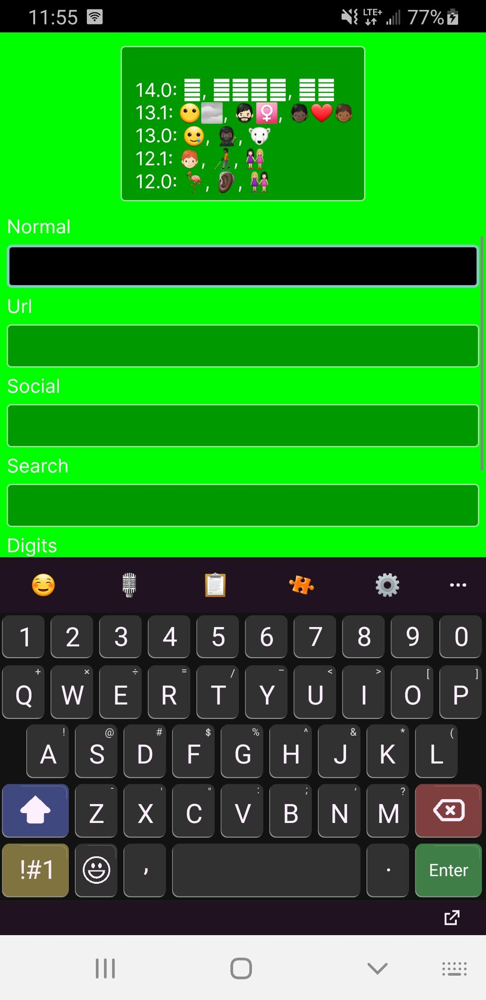
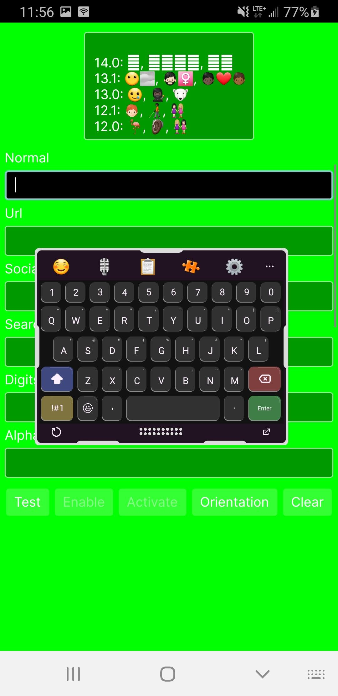
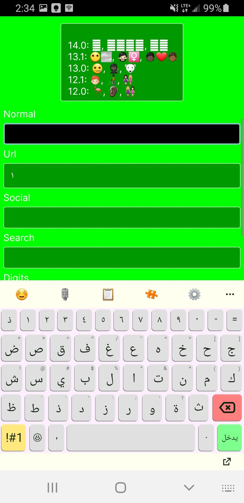
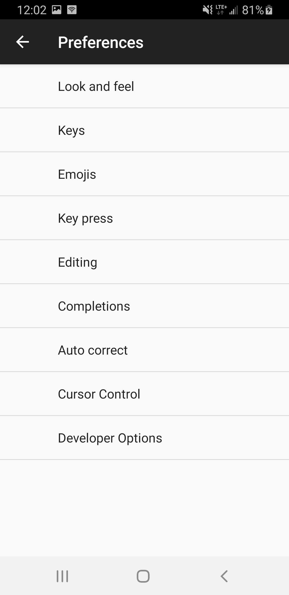
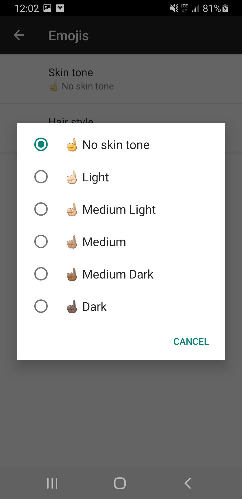

# MonkeyBoard 

                

Softkeyboard compatible with **both** Android and iOS.

Currently supports (with varying degrees of functionality) **53 different cultures** all with unique sets of keyboards and language dictionaries.

## Features
- Autocomplete, autocorrect, word learning and word forgetting (also emojis)
- Spacebar cursor controls
- Emoji mode with emoji search and recently used list
- Floating mode
- Mobile and tablet layouts and UX
- Dark/light themes
- Smart punctuation, auto-capitalization
- And much more...

## Language Packs
- Language packs are NOT included in this repo but all are available on my website [here](https://www.monkeypaste.com/dat/kb/kb-index.json). 
- You'll need to move them to:
`MonkeyBoard.Common/Assets/Localization/packs/<culture-code>/<culture-code>.zip` for the build to pick them up.

## Caveats
- .net iOS extension support is rough to say the least. Apple caps memory of keyboard extensions to ~80MB (it varies between devices), when its exceeded the extension will silently exit. There's no simple way to profile or debug on ios that I could manage to get to work so beware!
- I DID manage to get a working build on my iPad but it still crashes intermittently. Maybe other devices will have better luck? It'd be nice to know your findings if you try it out :)

## Special Thanks
[AnySoftKeyboard](https://github.com/anysoftkeyboard) for providing a nice collection of keyboards (and word corpus' too!)

